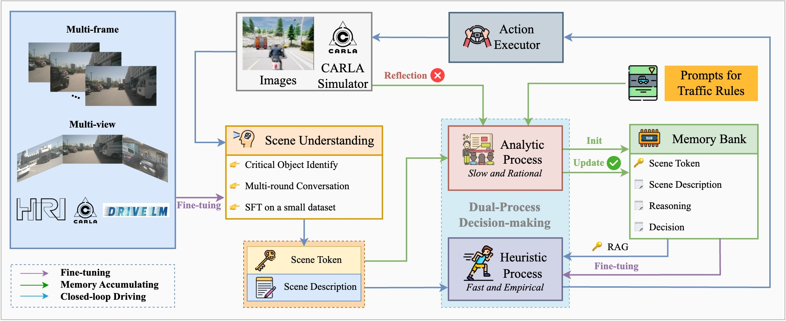

#  LeapVAD: A Leap in Autonomous Driving via Cognitive Perception and Dual-Process Thinking

[]() []() 


> Yukai Ma<sup>1,2</sup>, Tiantian Wei<sup>3,2</sup>, Naiting Zhong<sup>4,2</sup>, Jianbiao Mei<sup>1,2</sup>, Tao Hu<sup>5,2</sup>, Licheng Wen<sup>2</sup>, Xuemeng Yang<sup>2</sup>, Botian Shi<sup>2,†</sup>, Yong Liu<sup>1,†</sup>

> <sup>1</sup> Zhejiang University <sup>2</sup> Shanghai Artificial Intelligence Laboratory <sup>3</sup> Technical University of Munich <sup>4</sup> Tongji University<br> <sup>5</sup> University of Science and Technology of China <br>
> <sup>†</sup> Corresponding Authors

## 🎯 Overview
<div style="text-align:center;">
  
</div>
Autonomous driving technology has made progress, but data-driven methods still struggle with complex scenarios due to limited reasoning capabilities. Knowledge-driven systems have improved with the development of visual language models. Our approach uses a human attentional mechanism to identify key traffic elements, utilizing their attributes for more efficient environmental representation and simplified decision-making.
Additionally, we introduce a dual-process decision-making module that mimics human driving learning, consisting of a slow system (accumulating experience) and a fast system (optimizing knowledge). This method also features reflective mechanisms and a memory bank for continuous performance improvement.
The scene encoder network we developed generates compact scene tokens for efficient retrieval of relevant driving experiences. Evaluations on the CARLA and DriveArena simulators demonstrate that our method outperforms camera-only approaches with limited training data, excelling in continuous learning and domain adaptation.

## 💻 Code
The code for LeapVAD will be updated in this repository.

## 📖 News

- `[2025-1-14]` The paper can be accessed at [arxiv]().

- `[2025-1-14]` We released our project website [here]().

- `[2025-1-14]` Preliminary work for this job (LeapAD) can be found [here](https://github.com/PJLab-ADG/LeapAD).


## 🔖 Citation

If you find our project useful, please kindly cite us via:

```bibtext
@misc{ma2025leapvadleapautonomousdriving,
      title={LeapVAD: A Leap in Autonomous Driving via Cognitive Perception and Dual-Process Thinking}, 
      author={Yukai Ma and Tiantian Wei and Naiting Zhong and Jianbiao Mei and Tao Hu and Licheng Wen and Xuemeng Yang and Botian Shi and Yong Liu},
      year={2025},
      eprint={2501.08168},
      archivePrefix={arXiv},
      primaryClass={cs.AI},
      url={https://arxiv.org/abs/2501.08168}, 
}
@misc{mei2024continuouslylearningadaptingimproving,
      title={Continuously Learning, Adapting, and Improving: A Dual-Process Approach to Autonomous Driving}, 
      author={Jianbiao Mei and Yukai Ma and Xuemeng Yang and Licheng Wen and Xinyu Cai and Xin Li and Daocheng Fu and Bo Zhang and Pinlong Cai and Min Dou and Botian Shi and Liang He and Yong Liu and Yu Qiao},
      year={2024},
      eprint={2405.15324},
      archivePrefix={arXiv},
      primaryClass={cs.RO},
      url={https://arxiv.org/abs/2405.15324}, 
}